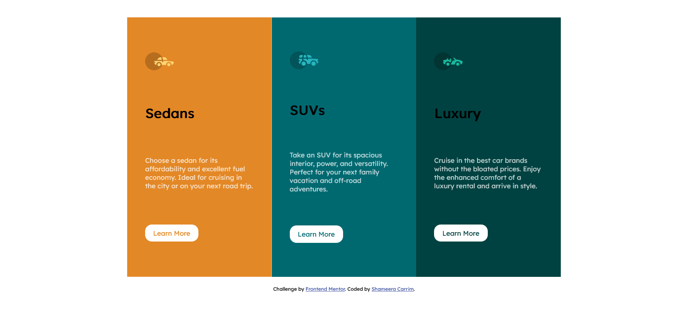

# Frontend Mentor - 3-column preview card component solution

This is a solution to the [3-column preview card component challenge on Frontend Mentor](https://www.frontendmentor.io/challenges/3column-preview-card-component-pH92eAR2-). Frontend Mentor challenges help you improve your coding skills by building realistic projects. 

## Table of contents

- [Overview](#overview)
  - [The challenge](#the-challenge)
  - [Screenshot](#screenshot)
  - [Links](#links)
- [My process](#my-process)
  - [Built with](#built-with)
  - [What I learned](#what-i-learned)
  - [Useful resources](#useful-resources)
- [Author](#author)

## Overview

Refresh Front-End Dev 
Day - 01
Task From - Frontend Mentor

### The challenge

Users should be able to:

- View the optimal layout depending on their device's screen size
- See hover states for interactive elements

### Screenshot

### Links

- Solution URL: [@Github](https://github.com/Shameera17/3-column-preview-card-component-main.git)

## My process

### Built with

- Semantic HTML5 markup
- CSS custom properties
- Flexbox
- CSS Grid
- Mobile-first workflow

### What I learned

1. Layout using grid
2. Arrange content usins Flex Box
3. Use media query

### Useful resources

1. media query - [https://www.w3schools.com/cssref/css3_pr_mediaquery.asp]
media query was used to adjust the column and row to fit according to the different screen sizes

2. CSS Grid - [Udemy - The Complete Web Developer in 2021 Zero to Mastery]

3. CSS Flex-Box - [Udemy - The Complete Web Developer in 2021 Zero to Mastery]

## Author

- Frontend Mentor - [@Shameera17](https://www.frontendmentor.io/profile/Shameera17)
- Twitter - [@Shameea17](https://twitter.com/Shameea17)

